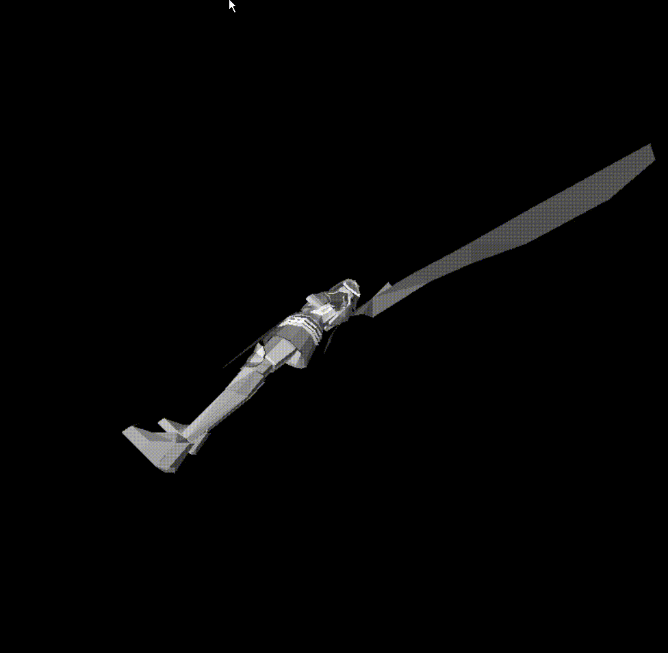
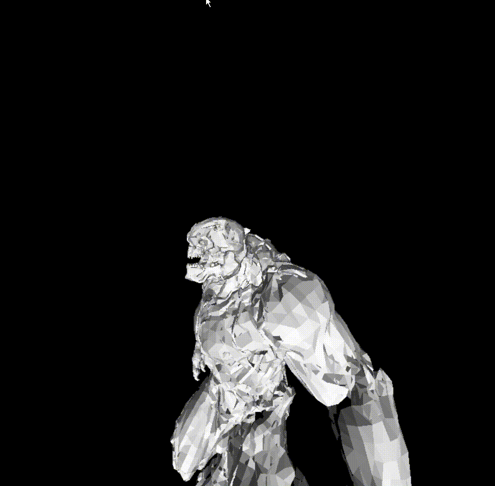

OUTDATED, i implemented the rasterization myself so this stuff is outdated, maybe ill update it 

3D rendering with capability to load in translate OBJ files within Python

Display made with pygame

(Working on more optimizations)

# #
## Lower Face Count Model ##

# #
## Higher Face Count Model ##

